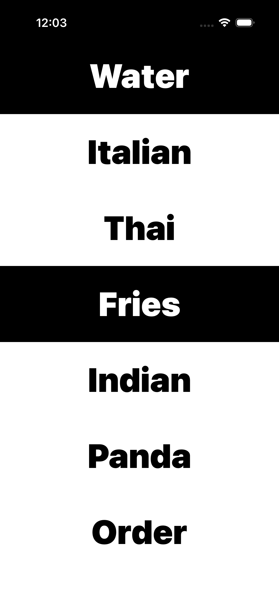

## design: removes pâro when ordering food delivery
**pâro** n. the feeling that everything you do is always somehow wrong

<br>

**Status:** Active Development - Postmates API Integration + Firebase Authentication

POC: Simple 2-page mobile app with preset food ordering options based on cuisine selection. Backend API integration with Postmates for real-time delivery quotes and order placement.

## Features

- 🎨 **Minimalist Design:** Clean 2-page interface (Welcome → Cuisine Selection → Confirmation)
- 🍜 **Cuisine-Based Ordering:** Select from preset cuisines (Thai, Italian, Indian, Fries, Panda, Water)
- 🚚 **Postmates Integration:** Real-time delivery quotes and order placement
- 🔐 **Firebase Authentication:** Secure user authentication (Email, Google, Apple, Phone)
- 📱 **Push Notifications:** Order status updates via Firebase Cloud Messaging
- 💾 **Order History:** Persistent storage with SwiftData and Firestore

## Quick Start

### Prerequisites
- Xcode 15.0+
- iOS 17.0+
- Firebase account
- Postmates API credentials

### Setup

1. **Clone the repository**
   ```bash
   git clone https://github.com/rlogger/eaterr.git
   cd eaterr
   ```

2. **Set up Firebase**
   - Follow the detailed guide in [`FIREBASE_SETUP.md`](FIREBASE_SETUP.md)
   - Download `GoogleService-Info.plist` from Firebase Console
   - Add it to the Xcode project

3. **Configure server**
   - See [`server-config.txt`](server-config.txt) for complete backend setup
   - Set up Postmates API credentials
   - Deploy backend server

4. **Build and run**
   ```bash
   open eater.xcodeproj  # Or eater.xcworkspace if using CocoaPods
   # Build and run in Xcode
   ```

## Project Structure

```
eaterr/
├── WelcomeView.swift           # Landing screen with app branding
├── CuisineSelectionView.swift  # Cuisine selection and order placement
├── ConfirmationView.swift      # Order confirmation display
├── OrderService.swift          # API client for backend communication
├── AuthService.swift           # Firebase authentication service
├── Item.swift                  # Data models (Order, User, etc.)
├── eaterApp.swift             # App entry point
├── FIREBASE_SETUP.md          # Firebase setup guide
├── SYSTEM_DESIGN.md           # System architecture documentation
└── server-config.txt          # Server-side configuration reference

## Documentation

- **[System Design](SYSTEM_DESIGN.md)** - Complete system architecture, data flow, and technical specifications
- **[Firebase Setup](FIREBASE_SETUP.md)** - Step-by-step Firebase integration guide
- **[Server Configuration](server-config.txt)** - Backend API setup and credentials reference

<div align="center">
  
  
</div>

<br>

**Delivery Platform Integrations**
- **Postmates** (Primary - Active Integration)
- Uber Eats (Planned)
- DoorDash (Planned)
- Grubhub (Planned)

**Technology Stack**
- **Frontend:** Swift, SwiftUI, SwiftData
- **Backend:** Node.js (Planned), Express.js
- **Authentication:** Firebase Auth
- **Database:** Firestore
- **Cloud Services:** Google Cloud Platform
- **API Integration:** Postmates API v1
